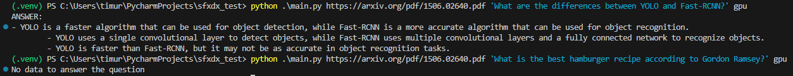

# RAG LLM
This is a test task to SFXDX
Simple RAG system that can help you answer on questions related to PDF files

Made with Langchain and its' modules:
- FAISS vectorstore
- HuggingFaceEmbeddings
- LLM from GPT4All model: Falcon

## Preparation
- Download LLM model from GPT4All to `./model` directory: https://gpt4all.io/models/gguf/gpt4all-falcon-newbpe-q4_0.gguf
- Install requirements: `pip install -r requirements.txt`

## To run on GPU
1. Install CUDA and cuDNN compatible with your system and GPU
2. Visit https://pytorch.org/get-started/locally/
3. Choose appropriate options (tested on Pytorch Stable 2.2.0 + Windows + Pip + Python + CUDA 12.1)
4. run command to install and build torch for CUDA

## Usage
`python run.py {link} {question} {mode}`
where:
- `link` URL of PDF
- `question` your question "in brackets"
- `mode` "cpu" or "gpu" for embeddings

## Tests
Script was tested on:
- https://arxiv.org/pdf/1506.02640.pdf (YOLO Paper)
- https://www.surrey.ac.uk/sites/default/files/2018-03/skills-based-cv.pdf (CV example)
- https://arxiv.org/pdf/2103.15348.pdf (Document Image Analysis)

## Example

